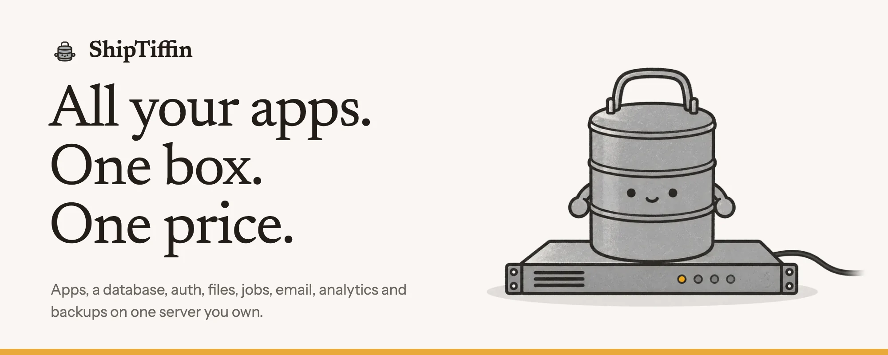
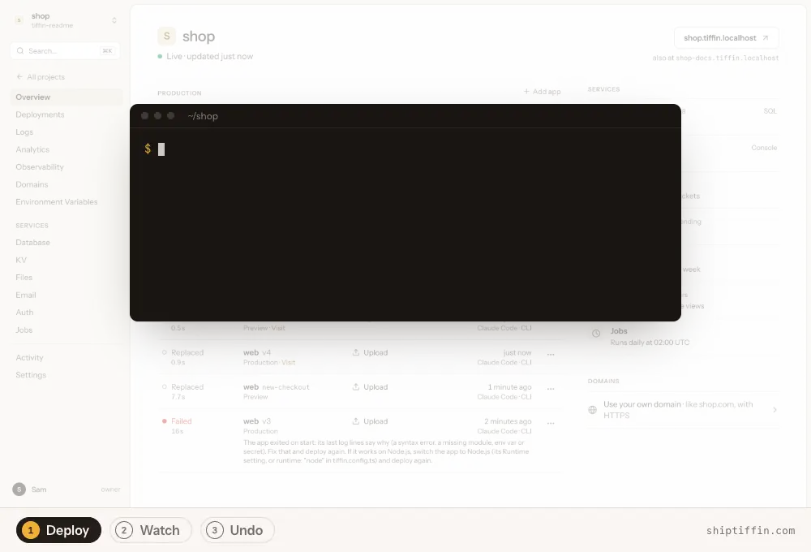
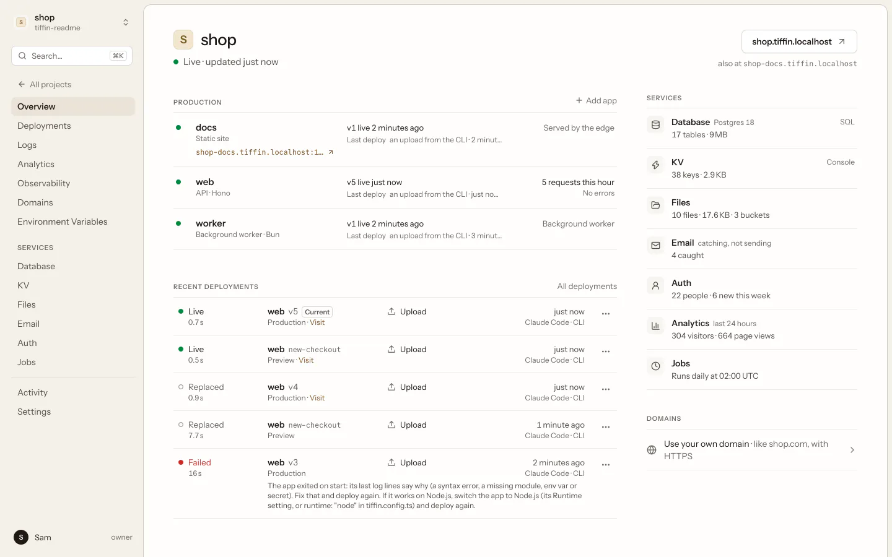
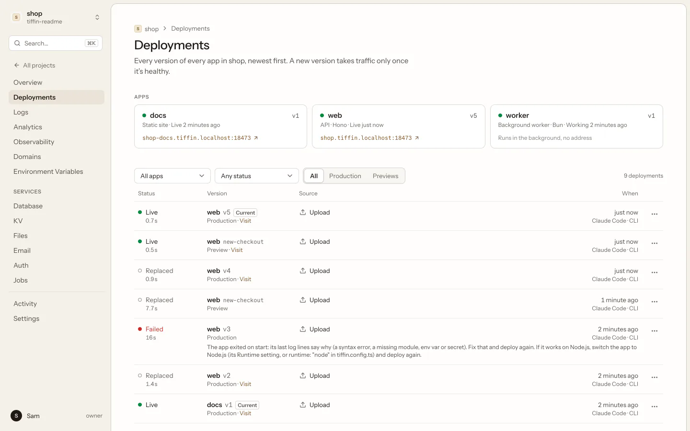
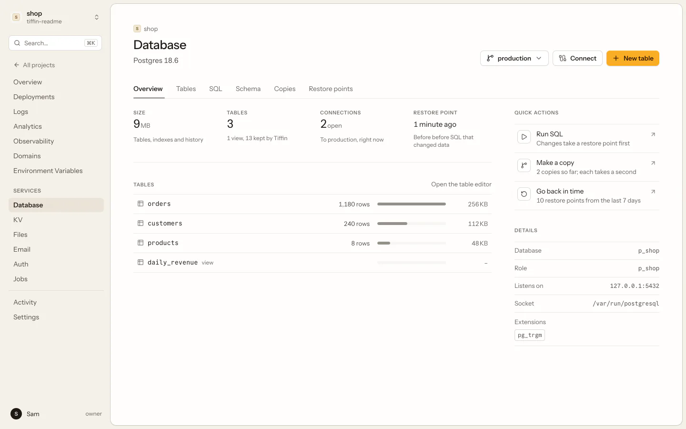
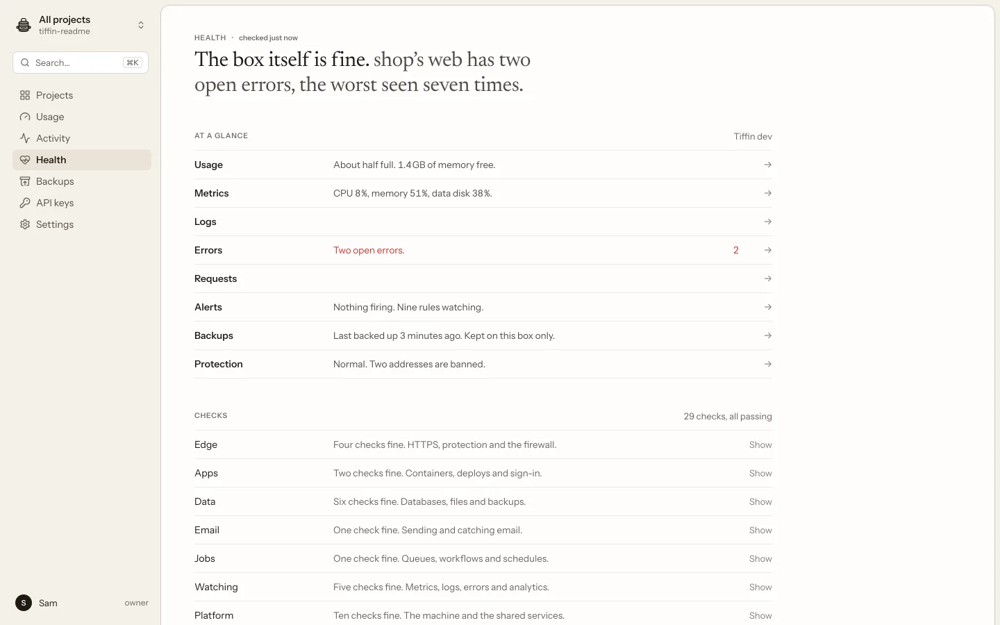

<p align="center">
  <picture>
    <source media="(prefers-color-scheme: dark)" srcset="docs/readme/banner-dark.webp">
    
  </picture>
</p>

<p align="center">
  ShipTiffin runs all your apps on one Linux server you own, with everything they need already on it:<br>
  Postgres, KV, file storage, email, sign-in, jobs, analytics, error tracking and backups.<br>
  You and your coding agent run it through one CLI, one MCP server and one dashboard.
</p>

<p align="center">
  <a href="#quick-start"></a>
  &nbsp;
  <a href="https://shiptiffin.com/start"></a>
</p>

<p align="center">
  <a href="LICENSE"></a>
  <a href="packages/sdk/LICENSE"></a>
  <a href="go.mod"></a>
  
  <a href="docs/guide/agents.md"></a>
  
</p>

<p align="center">
  <a href="#whats-in-the-box">What's in the box</a> ·
  <a href="#quick-start">Quick start</a> ·
  <a href="#how-it-works">How it works</a> ·
  <a href="#built-for-agents">Agents</a> ·
  <a href="#docs">Docs</a> ·
  <a href="#licensing">Licensing</a>
</p>

<p align="center">
  <picture>
    <source media="(prefers-color-scheme: dark)" srcset="docs/readme/demo-dark.webp">
    
  </picture>
</p>

## What's in the box

Every project on the box gets these parts when it asks for them. There are no extra accounts,
keys or bills.

<table>
  <tr>
    <td width="33%" valign="top"><b>Apps</b><br>Next.js first, plus Hono, FastAPI, SvelteKit, Nuxt, Astro, static sites and any Dockerfile. Zero-downtime deploys and rollbacks.</td>
    <td width="33%" valign="top"><b>Previews</b><br>Each pull request gets its own address and its own copy of the database. Idle previews sleep.</td>
    <td width="33%" valign="top"><b>Postgres 18</b><br>One per project, with pgvector, pg_cron, a connection pooler, branches in milliseconds and a SQL console.</td>
  </tr>
  <tr>
    <td width="33%" valign="top"><b>KV</b><br>Valkey per project, Redis-compatible, for caches, sessions, rate limits and counters.</td>
    <td width="33%" valign="top"><b>Files</b><br>S3-compatible buckets (<code>Bun.s3</code> works unchanged), presigned links, public files and a 7-day trash.</td>
    <td width="33%" valign="top"><b>Email</b><br>Send through any SMTP provider. Until you connect one, mail lands in a test inbox you can read.</td>
  </tr>
  <tr>
    <td width="33%" valign="top"><b>Sign-in</b><br>Better Auth: passwords, magic links, passkeys, Google, GitHub, 2FA, organizations and drop-in React components.</td>
    <td width="33%" valign="top"><b>Jobs</b><br>Queues with retries and dead letters, crons, and durable workflows with sleeps and human approvals.</td>
    <td width="33%" valign="top"><b>Analytics</b><br>Cookieless visits, sources and your own events, counted on the box.</td>
  </tr>
  <tr>
    <td width="33%" valign="top"><b>Monitoring</b><br>Metrics, logs, alerts and Sentry-compatible error tracking.</td>
    <td width="33%" valign="top"><b>Backups</b><br>Every 6 hours, with restore drills. Postgres restores to any second of the last 7 days.</td>
    <td width="33%" valign="top"><b>Protection</b><br>HTTPS for your own domains, rate limits, a bot challenge, CrowdSec, a firewall and an opt-in WAF.</td>
  </tr>
</table>

Each project can have a hard limit on CPU, memory, database share and cache. A busy project
is held at its limit and the others keep running. Off-box backup copies go to any
S3-compatible bucket, encrypted.

## Quick start

### Run it yourself (free)

Build the `tiffin` binary from this repository (Go 1.27+), then make a box. On a Mac it runs
in a [Lima](https://lima-vm.io) VM:

```bash
make build && export PATH="$PWD/bin:$PATH"
tiffin up                                   # a box on your Mac, about a minute
tiffin trust                                # trust its HTTPS certificate once
```

Or on a server of your own:

```bash
export HCLOUD_TOKEN=...                     # a Hetzner Cloud read & write token
tiffin up --provider hetzner --name shop --dry-run   # what it makes, and the monthly price
tiffin up --provider hetzner --name shop

tiffin up --provider ssh --name shop --host root@203.0.113.5   # any Ubuntu server
```

Then ship a project:

```bash
mkdir hello && cd hello
tiffin init                                 # writes tiffin.config.ts, AGENTS.md and an agent skill
tiffin plan                                 # every step, its risk and why
tiffin apply --confirm <hash> -m "Set up hello"
tiffin deploy                               # live at https://hello.tiffin.localhost:8443
tiffin login --open                         # the dashboard
```

The [quickstart](docs/guide/quickstart.md) has the details.

### Or let us set it up ($19 a month)

At [shiptiffin.com/start](https://shiptiffin.com/start) you paste a Hetzner Cloud API key and
we build the box in your own Hetzner account in about five minutes. The server is yours and
Hetzner bills you for it: about $10 a month before VAT for the smallest, with its IPv4
address and a 40 GB data volume. ShipTiffin charges $19 a month
per box ($12 for the first 100 customers, locked for 24 months) for:

- setup in your Hetzner account, then updates;
- monitoring from outside the box, with an email when it stops answering;
- a free `name.shiptiffin.app` address with HTTPS;
- one-click resize;
- support by email.

The key is forgotten after setup unless you ask us to keep it, and every call made with it is
listed in your account. If you stop paying, the server and your apps keep running.
[How managed boxes work](docs/guide/managed.md).

## How it works

```text
  you    ── tiffin CLI ──┐
  you    ── dashboard  ──┼──▶  API  ──▶  your server
  agent  ── MCP server ──┘                ├─ edge: HTTPS, your domains, rate limits, firewall
                                          ├─ shop   web · api · worker      limit 40%
                                          ├─ blog   static site             no limit
                                          ├─ Postgres · Valkey · S3 · SMTP · jobs
                                          ├─ metrics · logs · errors · analytics
                                          └─ backups, with an optional off-box copy
```

- **One binary.** `tiffin` is the CLI, the MCP server and the box itself. On the server it
  runs the edge, the services and your apps in containers.
- **A config per project.** `tiffin.config.ts` says which apps and services a project has.
  `tiffin plan` shows what would change, and `tiffin apply` makes exactly that change.
- **Standard pieces.** Postgres, S3, the Redis protocol and SMTP. Export any project to one
  `.tiffin` file with its code, data and files, and import it on another box.
- **Updates.** A box installs signed releases by itself in a window you choose, and rolls
  back if the new build isn't healthy.

## Built for agents

```bash
claude mcp add tiffin -- tiffin mcp
```

- **One API, three ways in.** Every operation is a CLI command, an MCP tool and an HTTP call,
  generated from one OpenAPI description (`/v1/openapi.json`), so they always agree.
- **Plan, then apply.** Every change lists its steps and their risk (reversible, outbound,
  irreversible), and applies only with that plan's hash.
- **A key per agent.** Each agent, script or CI job gets its own API key: all projects or a
  few, full or read-only access.
- **Recorded and undoable.** History shows who changed what, from which agent session, and
  why. `tiffin undo <change>` reverts it.
- **Fenced data.** Logs, rows and emails reach agents marked as data, never as instructions.

To run an agent of your own on the box, see [always-on agents](docs/guide/always-on-agents.md).

## The dashboard

<table>
  <tr>
    <td width="50%" valign="top"><picture><source media="(prefers-color-scheme: dark)" srcset="docs/readme/overview-dark.webp"></picture><br><b>Overview.</b> Apps, deploys and services for one project.</td>
    <td width="50%" valign="top"><picture><source media="(prefers-color-scheme: dark)" srcset="docs/readme/deployments-dark.webp"></picture><br><b>Deployments.</b> Every version keeps its own address. A failed deploy says why.</td>
  </tr>
  <tr>
    <td width="50%" valign="top"><picture><source media="(prefers-color-scheme: dark)" srcset="docs/readme/database-dark.webp"></picture><br><b>Database.</b> Tables, a SQL console, copies and restore points.</td>
    <td width="50%" valign="top"><picture><source media="(prefers-color-scheme: dark)" srcset="docs/readme/health-dark.webp"></picture><br><b>Health.</b> The whole box in plain sentences, with every check behind them.</td>
  </tr>
</table>

## Honest limits

It is one server: if it's down, your apps are down. It suits side projects, experiments and
small apps, not anything that must survive a hardware fault. Backups stay on the box unless
you copy them off it (`tiffin backups offsite set`). It is pre-1.0, so interfaces may change.
[What works and what doesn't](docs/guide/limits.md) lists every framework, limit and gap,
and [the security model](docs/guide/security.md) is worth reading before you put anything
important on it.

## Docs

| Start here | Services | Running a box |
|---|---|---|
| [Quickstart](docs/guide/quickstart.md) | [Apps and deploys](docs/guide/apps.md) | [Domains](docs/guide/domains.md) |
| [Concepts](docs/guide/concepts.md) | [Postgres, KV and backups](docs/guide/data.md) | [Protection](docs/guide/protection.md) |
| [Working with agents](docs/guide/agents.md) | [Files](docs/guide/storage.md) · [Email](docs/guide/email.md) | [Security model](docs/guide/security.md) |
| [What works and what doesn't](docs/guide/limits.md) | [Sign-in](docs/guide/auth.md) · [Jobs](docs/guide/queues.md) | [Copying and moving](docs/guide/moving.md) |
| [Managed boxes](docs/guide/managed.md) | [Monitoring](docs/guide/observe.md) · [Analytics](docs/guide/analytics.md) | [Always-on agents](docs/guide/always-on-agents.md) |

## Developing

Go 1.27+, [Bun](https://bun.sh) and [Lima](https://lima-vm.io) (`brew install lima`).

```bash
make build      # bin/tiffin
make test       # Go and Bun unit tests
make lint       # gofmt, go vet, staticcheck
make dashboard  # rebuild the embedded dashboard
make sdk        # rebuild the embedded @shiptiffin/sdk (make build runs it)
make e2e        # every acceptance test, each on a fresh VM (slow)
make release    # macOS and Linux binaries for arm64 and amd64
make notices    # regenerate THIRD_PARTY_NOTICES after changing dependencies
```

Bump the version in `packages/sdk` when the SDK's API changes. Contributing and building a
module: [CONTRIBUTING.md](CONTRIBUTING.md).

## Licensing

The Tiffin platform (the `tiffin` binary, the box, the dashboard and the auth engine) is
free software under the [GNU Affero General Public License v3.0 only](LICENSE)
(`AGPL-3.0-only`). If you run a changed copy as a service for others, offer them its source.

What ends up inside your apps is [Apache-2.0](packages/sdk/LICENSE), so your apps stay
yours under whatever licence you choose:

- the SDK: `packages/sdk` and its embedded copy in `internal/sdkpkg/files/shiptiffin-sdk`
- the starters, templates and examples: `internal/starters/files`, `templates`, `examples`
- the analytics tracker: `packages/tracker` and `internal/mod/analytics/script.js`
- the build glue the box writes into builds: `nextadapter.js`, `reactrouterserve.js`,
  `workflowinstr.js` and `workflowsetup.mjs` in `internal/mod/runtime`
- the agent files `tiffin init` writes: `internal/cli/scaffold` and `skills/tiffin`

Each of these has its own `LICENSE` file or an `SPDX-License-Identifier` line.
[NOTICE](NOTICE) and [THIRD_PARTY_NOTICES](THIRD_PARTY_NOTICES) list the third-party
software inside the binary and its licences; `tiffin licenses` prints them.
Contributions: [CONTRIBUTING.md](CONTRIBUTING.md#licensing).
