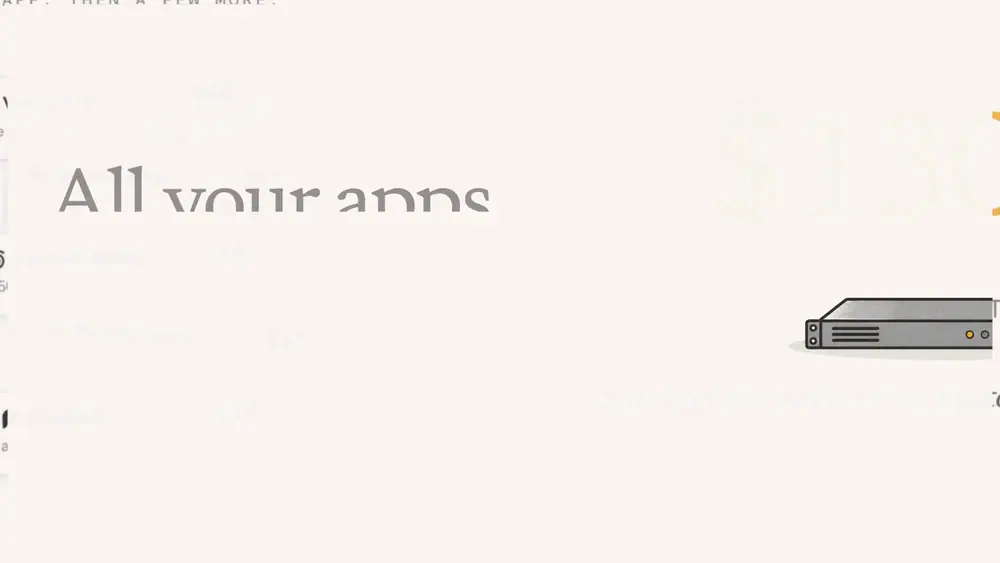
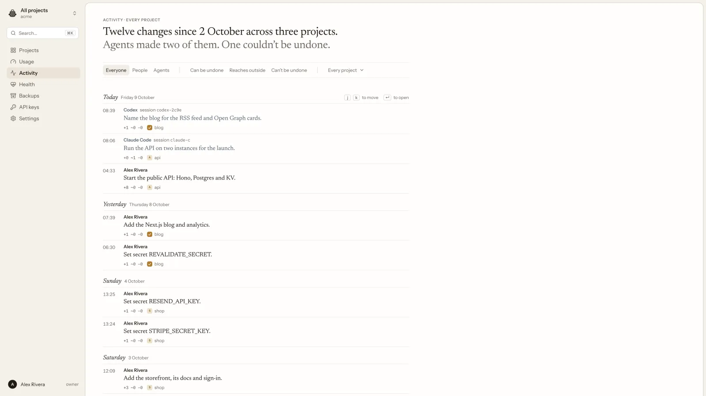
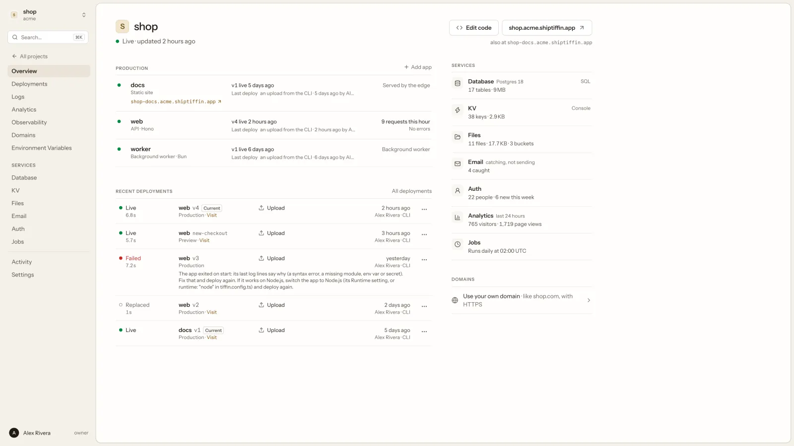
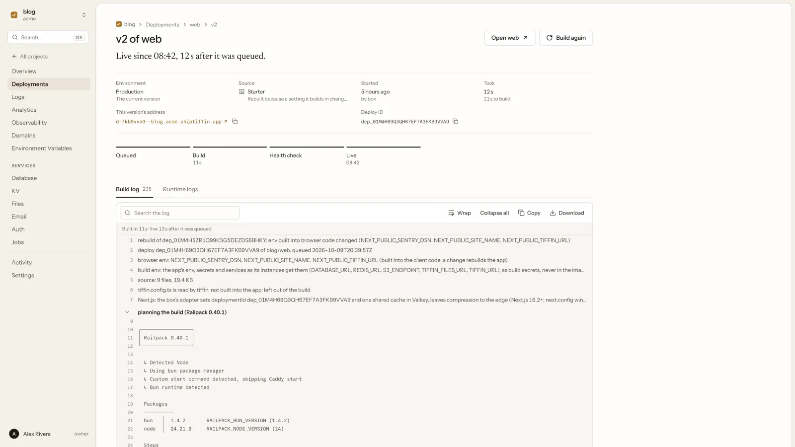
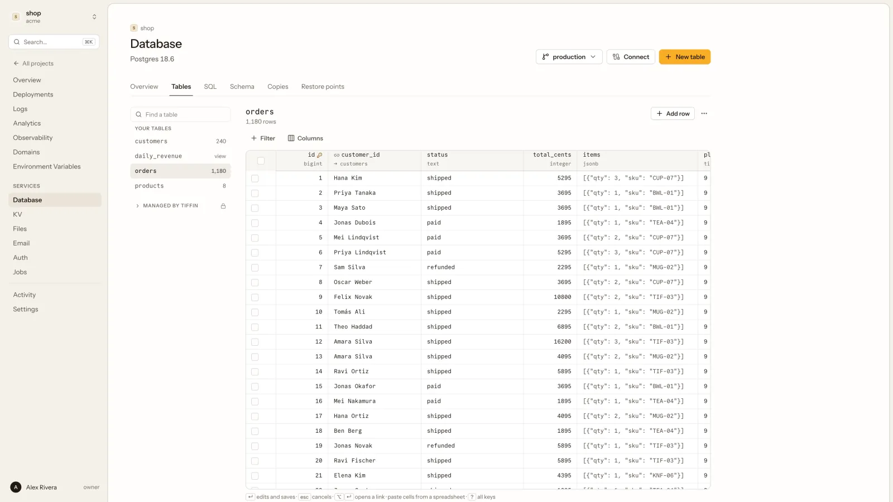
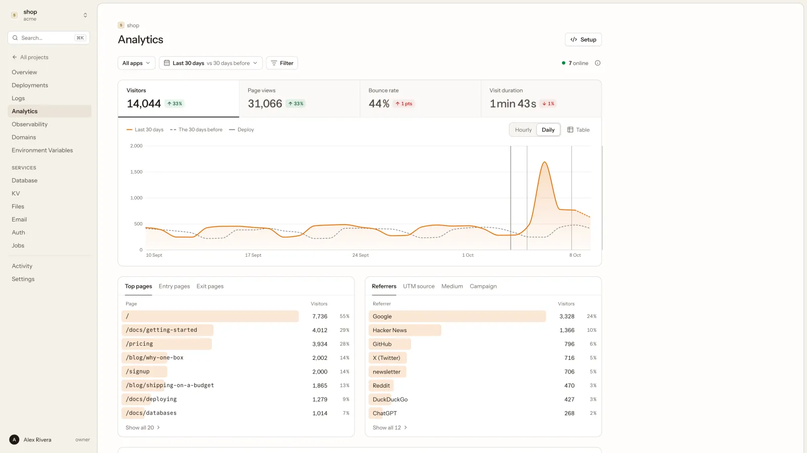

<p align="center">
  <picture>
    <source media="(prefers-color-scheme: dark)" srcset="docs/readme/banner-dark.webp">
    
  </picture>
</p>

<p align="center">
  <b>All your apps on one Linux server you own, with everything they need already on it.</b><br>
  a database, auth, KV, file storage, email, jobs, analytics, error tracking and backups.<br>
  You and your coding agent run it through one CLI, one MCP server and one dashboard.
</p>

<p align="center">
  <a href="LICENSE"></a>
  <a href="packages/sdk/LICENSE"></a>
  
</p>

<p align="center">
  <a href="#get-started">Get started</a> ·
  <a href="#whats-in-the-box">What's in the box</a> ·
  <a href="#built-for-coding-agents">Agents</a> ·
  <a href="#how-it-works">How it works</a> ·
  <a href="#honest-limits">Limits</a> ·
  <a href="#docs">Docs</a> ·
  <a href="https://shiptiffin.com">shiptiffin.com</a>
</p>

<p align="center">
  
</p>

## Why

A few small apps usually means five services and five bills. Four small Next.js apps, each
with a database and sign-in, plus a cache, error tracking and analytics, cost about
**$130 a month** bought separately (Vercel Pro, Supabase Pro, Upstash, Sentry Team and
Plausible, at their own published prices in October 2026). The same setup on one ShipTiffin
box is about **$29**: $19 for the managed service plus about $10 for the smallest Hetzner
server. Run it yourself and you pay only for the server.

You also stop juggling: one dashboard instead of five, no keys to copy between services, and
your data in one place you control. Each project gets a hard limit on CPU, memory and its
share of the database, so a busy app can't slow the others or grow the bill.

One small app on a free tier can cost less. ShipTiffin pays off from the second app.

## Get started

Three ways to run it. Pick one.

### 1. Managed: ready in about 5 minutes

Go to **[shiptiffin.com/start](https://shiptiffin.com/start)**, sign in, pay, and paste a
Hetzner Cloud API key. ShipTiffin builds the box in **your own** Hetzner account; the page
shows each step live. The key is used for that job and then forgotten, and every call made
with it is listed in your account. When it's ready, **Open your dashboard** signs you in.
Nothing to install.

- **$19 a month per box** ($12 for the first 100 customers, locked for 24 months), plus the
  server, which Hetzner bills you for: about $10 a month before VAT for the smallest, with
  its IPv4 address and a 40 GB data volume.
- You get updates, monitoring from outside the box, encrypted off-server backups every 6
  hours (kept 30 days, with a key only you hold), a free `name.shiptiffin.app` address,
  resizing from your account and support by email.
- If you stop paying, the server and your apps keep running.

[How managed boxes work](docs/guide/managed.md).

### 2. Self-host on Hetzner (free)

Install the `tiffin` CLI (macOS or Linux; on Windows, inside WSL), make a Read & Write API
token in the Hetzner Cloud console, then:

```bash
curl -fsSL https://shiptiffin.com/install.sh | sh
export HCLOUD_TOKEN=...                                  # Hetzner Cloud read & write token
tiffin up --provider hetzner --name shop --dry-run       # what it makes, and the monthly price
tiffin up --provider hetzner --name shop                 # a few minutes
```

It makes the server, a 40 GB data volume, a firewall and an SSH key. Run `tiffin up --name shop`
again any time to update it.

### 3. Self-host on any Ubuntu server (free)

Any Ubuntu 26.04 server you can reach over SSH with passwordless sudo (24.04 also works):

```bash
curl -fsSL https://shiptiffin.com/install.sh | sh
tiffin up --provider ssh --name shop --host root@203.0.113.5
```

Self-hosted, `tiffin up` ends by printing the dashboard's address and a one-time sign-in
link.

### Connect your computer and your agent

A box you made with `tiffin up` is already connected: every `tiffin` command on that
computer talks to it, and `claude mcp add --scope user tiffin -- tiffin mcp` connects Claude Code
(`codex mcp add tiffin -- tiffin mcp` for Codex).

For a managed box, or from another computer, create an API key in the dashboard
(Settings › API keys), install the CLI as above, and point it at the box:

```bash
export TIFFIN_URL=https://dashboard.<name>.shiptiffin.app   # the dashboard's address
export TIFFIN_TOKEN=<key>
tiffin whoami
```

Your agent gets a key of its own and connects over HTTP; the dialog that shows a new key
shows the line to paste ([agents](#built-for-coding-agents)).

### Ship your first project

In the dashboard, **New project** starts from a starter app or imports a GitHub repository:
every push deploys, and every pull request gets a preview. Or from your app's folder:

```bash
cd hello
tiffin init                                     # tiffin.config.ts, AGENTS.md and an agent skill
tiffin plan                                     # every step, its risk and why
tiffin apply --confirm <hash> -m "Set up hello"
tiffin deploy                                   # live at https://hello.<box domain>
```

The [quickstart](docs/guide/quickstart.md) has the details.

### Or hand it to your agent

Paste this into Claude Code or Codex:

```text
Set up ShipTiffin for me: follow https://shiptiffin.com/agent-setup.md
```

The agent asks which way you want (managed or self-hosted), does the steps it can, and stops
for the ones that are yours: paying, your Hetzner token, a passkey and its first API key.
Then it connects itself to your box and deploys your first app. Some agents summarize a page
they fetch, so for the surest result paste [the full prompt](docs/guide/agent-onboarding.md#the-prompt)
instead.

## What's in the box

Every project on the box gets these parts. There are no extra accounts, keys or bills.

| Part | What you get |
|---|---|
| **Apps** | Next.js first, plus Hono, FastAPI, SvelteKit, Nuxt, React Router, TanStack Start, Astro, static sites and any Dockerfile. Zero-downtime deploys and one-step rollbacks. |
| **Previews** | Each pull request gets its own address and its own copy of the database. Idle previews sleep. |
| **Postgres 18** | One per project, behind a connection pooler, with pgvector, pg_cron, branches in milliseconds and a SQL console. |
| **KV** | Valkey, Redis-compatible, for caches, sessions, rate limits and counters. |
| **Files** | S3-compatible buckets (`Bun.s3` works unchanged), presigned links, public files and a 7-day trash. |
| **Email** | Send through any SMTP provider. Until you connect one, mail lands in a test inbox you can read. |
| **Sign-in** | Better Auth: passwords, magic links, passkeys, Google, GitHub, 2FA, organizations and drop-in React components. |
| **Jobs** | Queues with retries and dead letters, crons, and durable workflows with sleeps and human approvals. |
| **Analytics** | Cookieless visits, sources and your own events, counted on the box. |
| **Monitoring** | Metrics, logs, alerts and Sentry-compatible error tracking. |
| **Backups** | Every 6 hours, with restore drills. Postgres restores to any second of the last 7 days. Off-box copies go to any S3-compatible bucket, encrypted. |
| **Protection** | HTTPS for your own domains, rate limits, a bot challenge, CrowdSec, a firewall and an opt-in WAF. |

## Built for coding agents

Every box serves an MCP server at `https://dashboard.<box domain>/mcp`. Give each agent its
own key (Settings › API keys), then connect it once:

```bash
# Claude Code (--scope user: in every folder, not only this one)
claude mcp add --transport http --scope user tiffin https://dashboard.<box domain>/mcp \
  --header "Authorization: Bearer <key>"

# Codex: first add `export TIFFIN_TOKEN=<key>` to your shell profile and restart Codex
codex mcp add tiffin --url https://dashboard.<box domain>/mcp --bearer-token-env-var TIFFIN_TOKEN
```

On the computer that ran `tiffin up` there is no key to make: `claude mcp add --scope user tiffin -- tiffin mcp`,
or `codex mcp add tiffin -- tiffin mcp`.

In each app's folder, `tiffin init` writes `AGENTS.md` (Codex and Claude Code both read it)
and a tiffin skill for each agent (`.claude/skills/tiffin` and `.agents/skills/tiffin`).
Codex's sandbox blocks network by default, so approve `tiffin` commands when it asks, or
set `network_access = true` under `[sandbox_workspace_write]` in `~/.codex/config.toml`.
Cursor, VS Code and other clients: see [connecting an agent](docs/guide/agent-onboarding.md#connecting-an-agent).

- **One API, three ways in.** Every operation is a CLI command, an MCP tool and an HTTP call,
  generated from one OpenAPI description (`/v1/openapi.json`), so they always agree.
- **Plan, then apply.** Every change lists its steps and their risk (reversible, outbound,
  irreversible), and applies only with that plan's hash.
- **A key per agent.** Each agent, script or CI job gets its own API key: all projects or a
  few, full or read-only access.
- **Recorded and undoable.** Activity shows who changed what, from which agent session, and
  why. `tiffin undo <change>` reverts it.
- **Fenced data.** Logs, rows and emails reach agents marked as data, never as instructions.

<p align="center">
  <picture>
    <source media="(prefers-color-scheme: dark)" srcset="docs/readme/dash-activity-dark.webp">
    
  </picture>
</p>

To run an agent of your own on the box, see [always-on agents](docs/guide/always-on-agents.md).

## The dashboard

<table>
  <tr>
    <td width="50%" valign="top"><picture><source media="(prefers-color-scheme: dark)" srcset="docs/readme/dash-project-dark.webp"></picture><br><b>Project.</b> Apps, deploys and every service with its size, on one page.</td>
    <td width="50%" valign="top"><picture><source media="(prefers-color-scheme: dark)" srcset="docs/readme/dash-deploy-log-dark.webp"></picture><br><b>Deploys.</b> Every version keeps its own address and its build log.</td>
  </tr>
  <tr>
    <td width="50%" valign="top"><picture><source media="(prefers-color-scheme: dark)" srcset="docs/readme/dash-database-table-dark.webp"></picture><br><b>Database.</b> Tables you can edit, a SQL console, copies and restore points.</td>
    <td width="50%" valign="top"><picture><source media="(prefers-color-scheme: dark)" srcset="docs/readme/dash-analytics-dark.webp"></picture><br><b>Analytics.</b> Visitors, pages and sources, without cookies.</td>
  </tr>
</table>

## How it works

```text
  you    ── tiffin CLI ──┐
  you    ── dashboard  ──┼──▶  API  ──▶  your server
  agent  ── MCP server ──┘                ├─ edge: HTTPS, your domains, rate limits, firewall
                                          ├─ shop   web · api · worker      limit 40%
                                          ├─ blog   static site             no limit
                                          ├─ Postgres · Valkey · S3 · SMTP · jobs
                                          ├─ metrics · logs · errors · analytics
                                          └─ backups, with an optional off-box copy
```

- **One binary.** `tiffin` is the CLI, the MCP server and the box itself. On the server it
  runs the edge, the services and your apps in containers.
- **A config per project.** `tiffin.config.ts` says which apps and services a project has.
  `tiffin plan` shows what would change, and `tiffin apply` makes exactly that change.
- **Standard pieces.** Postgres, S3, the Redis protocol and SMTP. Export any project to one
  `.tiffin` file with its code, data and files, and import it on another box.
- **Updates.** A box installs signed releases by itself in a window you choose, and rolls
  back if the new build isn't healthy.

## Honest limits

It is one server: if it's down, your apps are down. It suits side projects, small products
and experiments, not anything that must survive a hardware fault or serve many regions.
Backups stay on the box unless you copy them off it (`tiffin backups offsite set`, or a
managed box). It is pre-1.0, so interfaces may change.

[What works and what doesn't](docs/guide/limits.md) lists every framework, limit and gap.
Read [the security model](docs/guide/security.md) before you put anything important on it.

## Docs

| Start here | Services | Running a box |
|---|---|---|
| [Quickstart](docs/guide/quickstart.md) | [Apps and deploys](docs/guide/apps.md) | [Domains](docs/guide/domains.md) |
| [Concepts](docs/guide/concepts.md) | [Postgres, KV and backups](docs/guide/data.md) | [Protection](docs/guide/protection.md) |
| [Set up with your agent](docs/guide/agent-onboarding.md) | [Files](docs/guide/storage.md) · [Email](docs/guide/email.md) | [Security model](docs/guide/security.md) |
| [Working with agents](docs/guide/agents.md) | [Sign-in](docs/guide/auth.md) · [Jobs](docs/guide/queues.md) | [Copying and moving](docs/guide/moving.md) |
| [What works and what doesn't](docs/guide/limits.md) | [Monitoring](docs/guide/observe.md) · [Analytics](docs/guide/analytics.md) | [Always-on agents](docs/guide/always-on-agents.md) |
| [Managed boxes](docs/guide/managed.md) | | |

Agents can read everything in one file: [shiptiffin.com/llms-full.txt](https://shiptiffin.com/llms-full.txt).

## Building from source

Go 1.27+, [Bun](https://bun.sh) and, for a local box, [Lima](https://lima-vm.io) (`brew install lima`).

```bash
make build      # bin/tiffin (uses the committed dashboard and SDK builds)
make test       # Go tests with the race detector, Bun tests and the site tests
make lint       # gofmt, go vet, staticcheck
```

[CONTRIBUTING.md](CONTRIBUTING.md) has the rest: the repository layout, a dev box, the
module contract and how to send a change.

## Contributing and security

Issues and pull requests are welcome, including ones written with a coding agent, as long as
the tests pass. Start with [CONTRIBUTING.md](CONTRIBUTING.md). Please report security
problems privately, as [SECURITY.md](SECURITY.md) describes, not in a public issue.

## License

The Tiffin platform (the `tiffin` binary, the box, the dashboard and the auth engine) is
free software under the [GNU Affero General Public License v3.0 only](LICENSE)
(`AGPL-3.0-only`). If you run a changed copy as a service for others, offer them its source.

What ends up inside your apps is [Apache-2.0](packages/sdk/LICENSE), so your apps stay
yours under whatever licence you choose:

- the SDK: `packages/sdk` and its embedded copy in `internal/sdkpkg/files/shiptiffin-sdk`
- the starters, templates and examples: `internal/starters/files`, `templates`, `examples`
- the analytics tracker: `packages/tracker` and `internal/mod/analytics/script.js`
- the build glue the box writes into builds: `nextadapter.js`, `reactrouterserve.js`,
  `workflowinstr.js` and `workflowsetup.mjs` in `internal/mod/runtime`
- the agent files `tiffin init` writes: `internal/cli/scaffold` and `skills/tiffin`

Each of these has its own `LICENSE` file or an `SPDX-License-Identifier` line.
[NOTICE](NOTICE) and [THIRD_PARTY_NOTICES](THIRD_PARTY_NOTICES) list the third-party
software inside the binary and its licences; `tiffin licenses` prints them.
